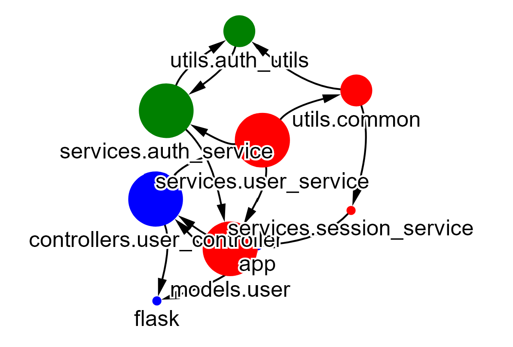

# Interactive import graph visualization

An interactive import graph visualization for a Python codebase.

## Getting started

Set `PROJECT_PATH` to the path to your codebase and set `ENTRY_POINT` to the project's entry point relative to the `PROJECT_PATH`.
Run `main.py`.
